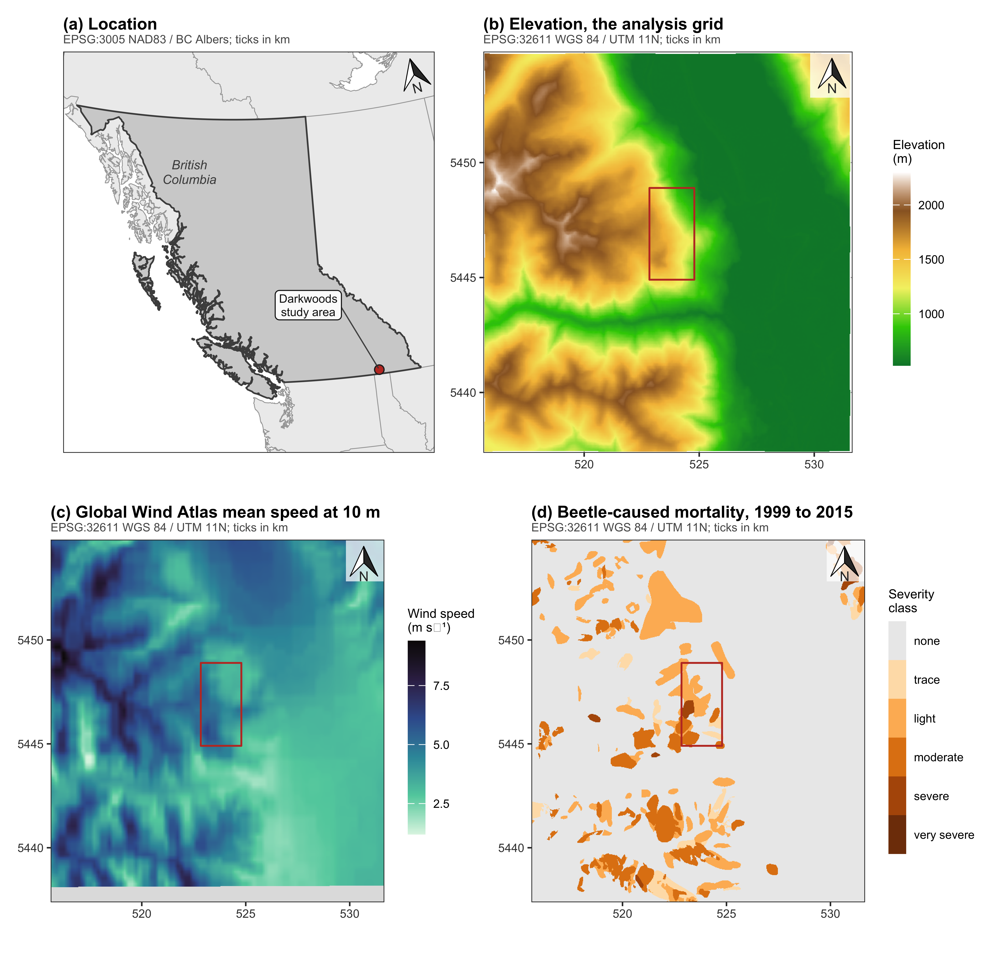
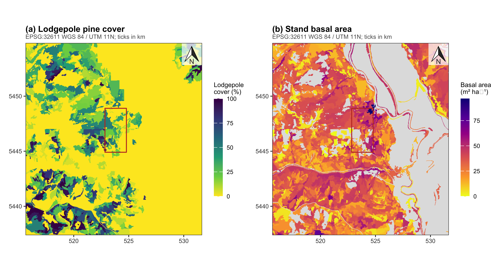
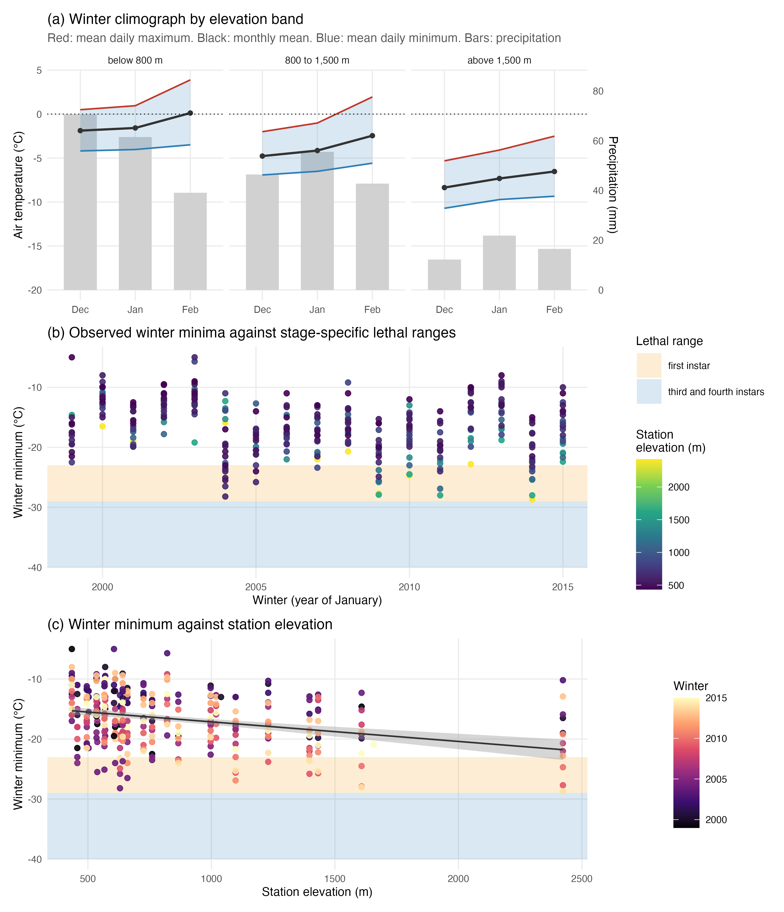

# Testing the wind disruption hypothesis for beetle refugia

*Host distribution, thermal load, and terrain-wind effects on Mountain pine beetle attack (Dendroctonus ponderosae) across 1,740 m of relief in the Selkirk Mountains of British Columbia*

Generated from the rendered manuscript by `03.outputs/build-readme.py`. Do not edit this file by hand: edit `01.manuscript/beetle-topography-wind-study.qmd`, render, then rerun the script.

## Abstract

Mass attack by mountain pine beetle (Dendroctonus ponderosae) is coordinated by an airborne pheromone plume. Refugia are therefore hypothesised to form where stands are thin enough for wind to disrupt that plume. The mechanism has never been tested spatially. We test it across 168 km2 of inventoried forest and 1,740 m of relief in British Columbia, combining an aerial survey of beetle-caused mortality (1999-2015) with inventory host attributes and Global Wind Atlas speed. Attack is unimodal, peaking near 1,430 m. Below 1,900 m that peak is the distribution of lodgepole pine. Above 1,900 m it is not: attack halves while cover holds. Coding host as cover alone overstates that result. Attack rises monotonically with stand diameter, from 15 to 41 per cent across the range, with the steepest step at the 25 cm source-sink threshold the species' bionomics predicts, and the share of stands above that threshold falls four-fold at the top of the gradient. Conditioning on diameter and the remaining host terms removes about a quarter of the high-elevation suppression and leaves three quarters standing. We find no wind effect. Orthogonalised against a linear elevation term, wind is the strongest negative predictor in host-bearing stands and clears the interval test at every severity threshold above trace. But a unimodal response leaves elevation's curvature inside that term, and refitting elevation as a quadratic or spline collapses the coefficient everywhere. The signal is a specification artefact. Nor is the predictor the quantity the insect responds to: the atlas reports an annual mean at 10 m over open ground, while flight is arrested by instantaneous below-canopy speeds near 2 m s-1. Thermal alternatives survive. Deep-winter air temperature within 100 km never approaches the lethal range for overwintering late instars, but our coldest reading lies inside the range for early instars, 41 per cent of minima fall in December before hardening completes, and the record excludes the shoulder months entirely. Loss of univoltine development at elevation predicts the same pattern without invoking wind. Elevation explains 0.63 of the wind surface's variance landscape-wide but 0.80 within a 2 by 4 km clip, where the estimate reverses sign; grain scarcely matters. At the extent disturbance ecology usually adopts this study would have reported the opposite; with severity collapsed to presence, no result at all; and without a host layer, absence of pine misread as refugia.

## Results

Every figure and table below is reproduced from the current render, in the order it appears in the manuscript.

### Table 1

*The studies retained by the review, with the attributes the objectives turn on, extracted from full text. The wind column records whether a wind term entered the model, not whether the word appears: every occurrence of wind in all eleven texts was read in context, and the per-study result is recorded in the review protocol.*

| Study | Year | Terrain terms | Wind in model | Occurrences of “wind” | Pages |
| :--- | :--- | :---: | :---: | ---: | ---: |
| wulder2006estimating | 2006 | yes | no | 0 | 17 |
| haukema2008movement | 2008 | yes | no | 1 | 11 |
| maciasfauria2009large | 2009 | yes | no | 0 | 19 |
| chen2011mountain | 2011 | yes | no | 2 | 17 |
| chen2013spatiotempor | 2013 | yes | no | 0 | 13 |
| walter2013multi | 2013 | yes | no | 0 | 11 |
| meddens2014spatial | 2014 | yes | no | 0 | 11 |
| cartwright2018landscape | 2018 | yes | no | 3 | 35 |
| krawchuk2020disturbance | 2020 | yes | no | 5 | 10 |
| murphy2026spatial | 2026 | yes | yes | 35 | 15 |
| Zabihi 2021 (unverified) | NA | yes | no | 1 | 19 |

### Figure 1

*The study area and the three spatial inputs. (a) Location within British Columbia; the marker is a 22 km symbol, not the footprint. (b) The elevation surface, which is the analysis grid. (c) Global Wind Atlas mean speed at 10 m; the shaded southern band lies outside the wind product’s extent. (d) Beetle-caused mortality from the Aerial Overview Survey, 1999 to 2015, as the maximum severity class in any year. The outlined rectangle in (b) to (d) is the 2 by 4 km clip of Section 5.8. Each panel’s graticule, axis ticks and stated coordinate reference system are the same; the system is named beneath the panel title and ticks are in kilometres.*

### Table 2

*Agreement between the Landsat red-stage classification and the aerial overview survey, by 300 m elevation band. The held-out quarter of the labelled sample, pooled over 2005 to 2013. This is agreement with the survey, not accuracy against ground truth: the survey is also the training source, and no independent reference exists at this extent.*

| Elevation band (m) | n | Attacked | Agreement | Kappa |  |
| :--- | ---: | ---: | ---: | ---: | :--- |
| (500,800] | 240 | 0 | 0.796 | 0.000 |  |
| (800,1100] | 69 | 7 | 0.507 | 0.026 |  |
| (1100,1400] | 180 | 124 | 0.639 | 0.100 |  |
| (1400,1700] | 402 | 299 | 0.724 | 0.179 |  |
| (1700,2000] | 222 | 125 | 0.550 | 0.038 |  |
| (2000,2300] | 17 | 1 | 0.824 | 0.338 |  |

### Table 3

*Where the Landsat classification and the aerial overview survey disagree, by year. Survey area is the share of the grid the survey mapped at moderate severity or worse. Model area is what the classifier calls attacked at its own threshold of zero. Hit rate is the share of calibrated classified cells that fall inside a survey polygon, and lift is that rate divided by the survey’s own prevalence, so 1.00 is chance.*

| Year | Survey area (%) | Model area (%) | Hit rate (%) | Lift |
| ---: | ---: | ---: | ---: | ---: |
| 2005 | 0.179 | 58.4 | 0.00 | 0.00 |
| 2006 | 1.271 | 38.8 | 1.95 | 1.54 |
| 2007 | 0.530 | 55.9 | 2.55 | 4.81 |
| 2008 | 0.972 | 36.2 | 0.58 | 0.60 |
| 2009 | 0.378 | 46.1 | 0.00 | 0.00 |
| 2010 | 0.618 | 26.7 | 1.30 | 2.11 |
| 2011 | 0.731 | 51.2 | 1.33 | 1.81 |
| 2012 | 0.092 | 66.3 | 0.00 | 0.00 |
| 2013 | 0.205 | 43.0 | 0.00 | 0.00 |
| 2014 | 0.000 | 39.0 | NA | NA |

### Figure 2

*The forest inventory host layers, rasterised onto the analysis grid. (a) Lodgepole pine cover, accumulated across the three species slots each polygon records. (b) Stand basal area, which defines the analysis frame: cells with no recorded basal area are dropped. Unshaded ground is unmapped or non-productive. Projection and scale as in Figure 1.*

### Table 4

*The analysis landscape, and the 2 by 4 km clip drawn from it that the companion study used. The clip samples under two thirds of the relief and under 4 per cent of the cells.*

| Extent | Cells | Area (km²) | Elevation (m) | Relief (m) | Attacked (%) |
| :--- | :--- | :--- | :--- | :--- | :--- |
| full landscape | 266,650 | 168.2 | 528 to 2268 | 1,740 | 20.9 |
| 2 by 4 km clip | 9,784 | 6.2 | 654 to 1747 | 1,093 | 45.3 |

### Table 5

*How much of each candidate predictor is elevation. The wind product is a mesoscale field draped over terrain and is largely an elevation transform. The heat load and shelter indices are computed from the same elevation model by trigonometry and are almost unrelated to it.*

| Surface | How it is built | R² on elevation |
| :--- | :--- | :--- |
| Global Wind Atlas wind speed | mesoscale field downscaled over the DEM | 0.629 |
| Heat load index (McCune and Keon) | trigonometric function of DEM aspect and slope | 0.000 |
| Shelter index (Winstral, omnidirectional) | maximum upwind slope from the DEM within 500 m | 0.002 |
| Topographic position, 625 m | deviation from surrounding DEM mean | 0.021 |

### Table 6

*Attack across the elevation gradient, before and after conditioning on lodgepole presence. Conditioning flattens the gradient below 1,900 m but not above it, where attack halves while lodgepole cover rises and stands thin.*

| band | Cells | Pine cover (%) | Basal area | Wind (m/s) | Attacked, all cells (%) | Attacked, host present (%) |
| :--- | :--- | :--- | :--- | :--- | :--- | :--- |
| (500,700] | 37,767 | 2.3 | 29.6 | 3.26 | 6.5 | 23.3 |
| (700,900] | 29,089 | 6.8 | 33.6 | 3.30 | 10.1 | 30.6 |
| (900,1100] | 27,172 | 11.4 | 33.6 | 3.42 | 15.1 | 26.2 |
| (1100,1300] | 26,645 | 18.2 | 32.9 | 3.69 | 29.2 | 31.5 |
| (1300,1500] | 35,264 | 23.3 | 33.3 | 4.17 | 36.0 | 37.4 |
| (1500,1700] | 42,860 | 29.9 | 30.3 | 4.89 | 30.1 | 33.4 |
| (1700,1900] | 48,278 | 30.9 | 29.5 | 5.70 | 21.9 | 28.1 |
| (1900,2100] | 18,354 | 19.5 | 24.0 | 6.70 | 12.2 | 14.6 |
| (2100,2300] | 1,221 | 13.8 | 19.2 | 7.74 | 0.0 | 0.0 |

### Figure 3

*(a) Attack across the gradient, raw and conditioned on lodgepole presence, with mean lodgepole cover. (b) The same data against wind speed: wind rises monotonically with elevation while attack turns over, so no monotone wind relationship can hold across the gradient. Shading marks the elevation range of the 2 by 4 km clip.*

### Table 7

*Attack by stand quadratic mean diameter, in cells carrying lodgepole pine. The published source-sink crossover for lodgepole is about 25 cm (Carroll and Safranyik 2004). The observed distribution reproduces that threshold without it being imposed.*

| Quadratic mean diameter (cm) | Cells | Attacked (%) | Lodgepole cover (%) | Basal area (m² ha⁻¹) |
| :--- | :--- | :--- | :--- | :--- |
| ≤ 15 | 4,209 | 15.7 | 76.3 | 3.9 |
| 15 to 20 | 15,213 | 19.2 | 44.8 | 17.1 |
| 20 to 25 | 52,101 | 27.4 | 47.8 | 28.9 |
| 25 to 30 | 32,656 | 35.8 | 34.5 | 33.6 |
| 30 to 35 | 16,210 | 38.5 | 16.2 | 39.1 |
| > 35 | 6,231 | 42.7 | 21.7 | 39.5 |

### Table 8

*The high-elevation decline, decomposed. Host cover is flat across the threshold; stem size is not. The final column restricts to stands above the 25 cm source-sink crossover, where the decline persists.*

| Band | Cells | Attacked (%) | Lodgepole cover (%) | Basal area (m² ha⁻¹) | Mean diameter (cm) | Stands > 25 cm (%) | Attacked, > 25 cm only (%) |
| :--- | :--- | :--- | :--- | :--- | :--- | :--- | :--- |
| below 1,900 m | 116,870 | 31.8 | 39.7 | 30.2 | 25.1 | 46.2 | 37.8 |
| above 1,900 m | 9,750 | 13.7 | 38.8 | 23.5 | 20.6 | 11.0 | 13.0 |

### Table 9

*Cumulative logits at each severity threshold, cells containing lodgepole pine only. The orthogonalised wind coefficient strengthens monotonically as the threshold rises and its block interval excludes zero above trace, which the binary model does not show.*

| Threshold | Cells | Wind residual beta | block 95% CI | sign stability | Pine cover beta | Supported |
| :--- | :--- | :--- | :--- | :--- | :--- | :--- |
| trace or worse | 38,473 | -0.176 | [-0.390, +0.037] | 0.95 | +0.177 | no |
| light or worse | 34,839 | -0.203 | [-0.418, -0.015] | 0.98 | +0.204 | yes |
| moderate or worse | 13,862 | -0.390 | [-0.674, -0.066] | 0.99 | +0.243 | yes |
| severe or worse | 1,522 | -1.002 | [-1.552, -0.169] | 0.98 | -0.101 | yes |

### Table 10

*The ordinal sweep refitted with elevation entered flexibly instead of linearly, and wind residualised against that same basis. Elevation explains eleven points more of the wind surface once curvature is allowed, and no threshold clears the interval test under either flexible basis.*

| Elevation basis | R² wind on basis | Threshold | Wind residual beta | block 95% CI | Supported |
| :--- | :--- | :--- | :--- | :--- | :--- |
| linear | 0.617 | trace or worse | -0.176 | [-0.390, +0.037] | no |
| linear | 0.617 | light or worse | -0.203 | [-0.418, -0.015] | yes |
| linear | 0.617 | moderate or worse | -0.390 | [-0.674, -0.066] | yes |
| linear | 0.617 | severe or worse | -1.002 | [-1.552, -0.169] | yes |
| quad | 0.726 | trace or worse | -0.051 | [-0.261, +0.158] | no |
| quad | 0.726 | light or worse | -0.075 | [-0.254, +0.085] | no |
| quad | 0.726 | moderate or worse | -0.160 | [-0.445, +0.156] | no |
| quad | 0.726 | severe or worse | -0.661 | [-1.139, +0.237] | no |
| spline | 0.728 | trace or worse | -0.064 | [-0.270, +0.146] | no |
| spline | 0.728 | light or worse | -0.090 | [-0.266, +0.059] | no |
| spline | 0.728 | moderate or worse | -0.163 | [-0.439, +0.161] | no |
| spline | 0.728 | severe or worse | -0.676 | [-1.169, +0.222] | no |

### Table 11

*The host-present model with the two aspect-derived terms added, at each threshold it can carry. Heat load is positive and strengthens sharply with severity: warmer aspects burn harder at the same elevation. The orthogonalised wind term is not displaced by it. The shelter index carries the opposite sign, and this result is examined rather than set aside.*

| Threshold | Cells | Wind residual | Heat load | Shelter |
| :--- | :--- | :--- | :--- | :--- |
| trace or worse | 38,473 | -0.214 [-0.424, +0.002] | +0.106 [-0.116, +0.331] | -0.153 [-0.253, -0.024] |
| light or worse | 34,839 | -0.234 [-0.441, -0.050] | +0.043 [-0.198, +0.274] | -0.152 [-0.262, -0.031] |
| moderate or worse | 13,862 | -0.505 [-0.804, -0.184] | +0.625 [+0.301, +1.030] | -0.013 [-0.144, +0.131] |

### Figure 4

*The observational climate record behind the cold check. (a) Winter climograph by elevation band: mean daily maximum, monthly mean and mean daily minimum air temperature, with monthly precipitation as bars rising from the floor of the temperature axis and read against the right-hand scale. Only December, January and February were retrieved, so the shoulder months in which a given temperature is most lethal are absent. The apparent decline of winter precipitation with elevation is a gauge artefact: the high-elevation stations are tipping-bucket instruments, which under-catch snowfall severely, and the bars are shown for the seasonal shape within a band rather than for comparison between bands. (b) Winter minima by year, one point per station-winter, against the lethal ranges reported by Safranyik and Carroll (2006) for first-instar larvae and for the third and fourth instars that normally overwinter. No station-winter enters the late-instar range. (c) The same minima against station elevation, showing that elevation orders them only weakly because cold air pools in the valleys.*

### Table 12

*The same model fitted at three extents. As the analysis area shrinks, the share of wind variance explained by elevation rises and the orthogonalised wind coefficient reverses sign. The 2 by 4 km clip is the extent at which the companion study was run.*

| Extent | Cells | Blocks | R² wind on elevation | VIF of raw wind | Wind residual beta | block 95% CI |
| :--- | :--- | :--- | :--- | :--- | :--- | :--- |
| full landscape (168 km²) | 266,650 | 253 | 0.629 | 2.7 | -0.304 | [-0.521, -0.098] |
| landscape, host present | 127,604 | 175 | 0.617 | 2.6 | -0.176 | [-0.390, +0.037] |
| 2 by 4 km clip (6.2 km²) | 9,784 | 15 | 0.797 | 4.9 | +0.239 | [-1.260, +0.921] |
