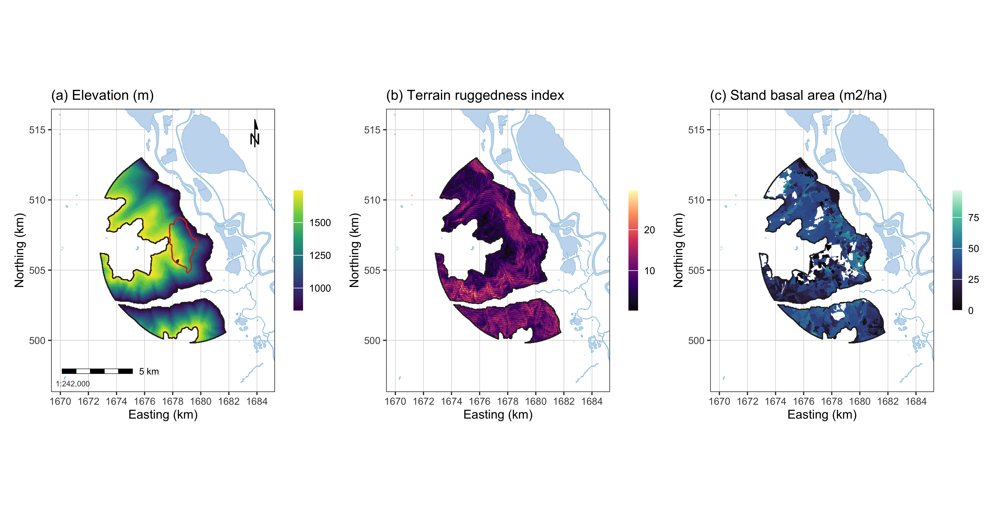
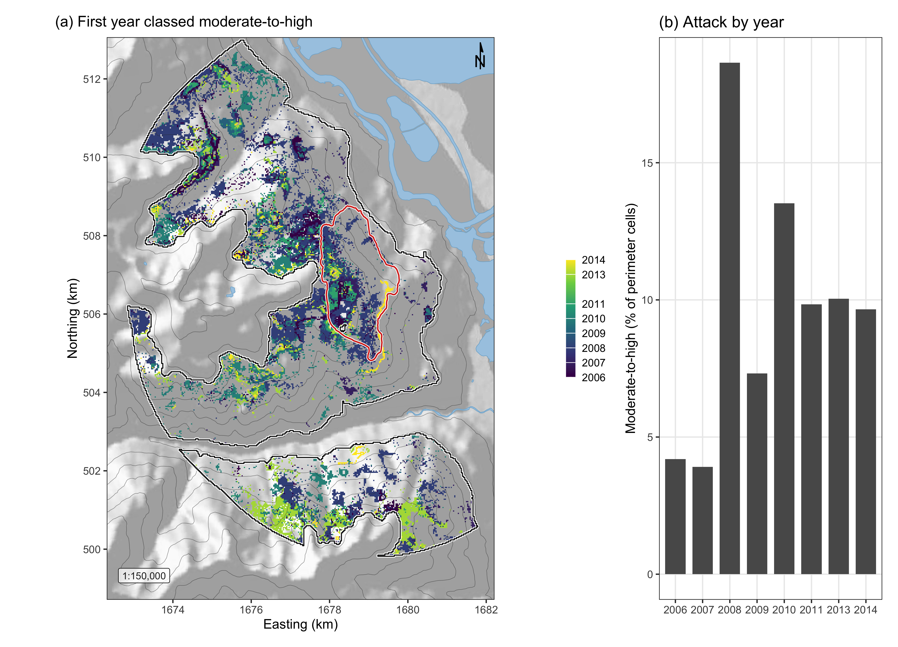
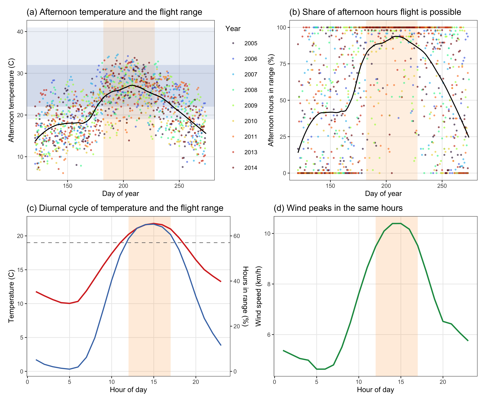
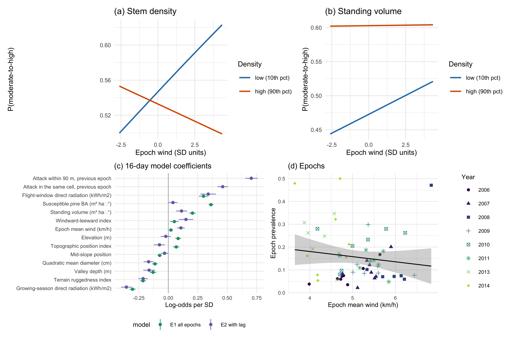

# Testing the wind disruption and disturbance refugia hypothesis for mountain pine beetle outbreaks (*Dendroctonus ponderosae*)

*Terrain, stand density and flight-period wind as controls on attack in the Selkirk Mountains of British Columbia*

Generated from the rendered manuscript by `01.manuscript/_tools/build-readme.py`. Do not edit this file by hand. Edit `01.manuscript/Manuscript.qmd`, render, then rerun the script.

## Abstract

Disturbance refugia from mountain pine beetle (Dendroctonus ponderosae Hopkins) outbreaks have been hypothesised by Krawchuk et al. (2020) to form where tree defences remain effective, on shaded ground that spares trees water stress or in thin stands with few large hosts where wind may disrupt the aggregation pheromone, and none has been fitted spatially. All three were tested across 5,573 ha of the Selkirk Mountains, British Columbia, using 59 sixteen-day Landsat epochs over eight outbreak years with annualized forest inventory, geomorphometric variables and a terrain-resolved MicroMet wind field from hourly station records. Wind disruption was supported conditionally, in that attack fell where a thin stand and strong flight-period wind coincided, the density-by-wind interaction -0.049 for stem density (p < 0.001) and -0.017 for standing volume (p < 0.05), both holding against within-season contagion. Terrain acted differently. Leeward ground had more attack as a main effect, -0.267, independent of stand density, and open gentle ground more still, sky view +0.285, which is the pattern expected if wind-borne beetles, which land without discriminating hosts, settle where the flow slows. Attack responded to host size as a threshold, peaking at 31.5 per cent in the 25 to 30 cm quadratic mean diameter class. The shade hypothesis failed, since north-facing slopes showed more attack (+0.384). Refugia are therefore proposed to lie on warm, windward ground in thin stands during windy flight periods, and the terrain ruggedness signal of the companion study resolves into shelter and openness.

## Results

Every figure and table below is reproduced from the current render, in the order it appears in the manuscript.

### Table 1

*Landscape attributes entered in this study, the direction expected of each, and the reasoning behind that expectation.*

| Attribute | Expected | Rationale |
| :--- | :--- | :--- |
| Stand BA, volume, crown closure, stems | positive | Denser canopy holds the pheromone plume together; thinner stands admit wind that disperses it (Powell and Bentz 2014; Cartwright 2018; Krawchuk et al. 2020). |
| Quadratic mean diameter | positive >25cm | Trees under 25 cm are beetle sinks, over 25 cm are sources (Carroll and Safranyik 2004). |
| Lodgepole pine cover and BA | positive | Attack cannot occur where the host is absent; a cell without pine is not a refugium (Cartwright 2018). |
| Flight-period direct radiation | positive | Flight is confined to 19 to 41 degrees C and peaks on bright afternoons, so sunlit slopes are reachable (McCambridge 1971; Safranyik and Carroll 2006). |
| Growing-season direct radiation | negative | Shading cools, relieving water stress and sustaining defence, and cool sites also push the beetle toward a two-year cycle (Krawchuk et al. 2020; Sambaraju and Goodsman 2021). |
| Terrain exposure to wind | negative | Wind disrupts the pheromone plume, so exposed ground should have less attack (Krawchuk et al. 2020). |
| Terrain shelter and sky view | positive, as main effect | Beetles land without discriminating hosts after wind-borne transport, so sheltered, open ground should receive more landings whatever the stand (Hynum and Berryman 1980; Jackson et al. 2008; Chen and Jackson 2017). |
| Terrain ruggedness | uncertain | The strongest terrain term in the companion study on this landscape, but fitted there against regeneration rather than attack (Murphy et al. 2026). |
| Convergence, wetness, valley & slope position | positive in convergent terrain | Infested groups gather in draws and gullies, and deep snow insulates overwintering brood (Safranyik and Carroll 2006). |
| Flight-period wind speed | negative | The mechanism acts during dispersal, and no study specifies the interval, so it is taken at the flight period (Jones et al. 2019; Krawchuk et al. 2020). |
| Elevation | uncertain | A composite of temperature, snowpack, season length and host distribution that this design cannot separate (Sambaraju and Goodsman 2021). |

### Table 2

*The datasets this study combined, with the structure and resolution of each. Spatial resolution was the grid on which a variable was analysed and temporal resolution the interval at which it varied. The response varied every 16 days, the inventory once a year, the station wind every hour and the terrain not at all, which was the unevenness the wind analysis depended on.*

| Dataset | Source | Variables | Spatial | Temporal | Period | n |
| :--- | :--- | :--- | :--- | :--- | :--- | ---: |
| Beetle attack (Annual) | Landsat 5 and 8 Collection 2 Level-2 | Moderate-to-high NDMI binary | 30 m | 1 year | 2006-2014, (excl. 2012) | 8 years |
| Beetle attack (/16-day) | Landsat 5 and 8 Collection 2 Level-2 | Moderate-to-high NDMI binary | 30 m | 16 days | 2006-2014, (excl. 2012) | 59 epochs |
| Stand structure | VRI Historical, BC Data Catalogue | BA, volume, stems, quadratic mean diameter, age, height | 30 m (rasterised) | 1 year, projected-yr | 2005-2014 | 9 windows |
| Terrain | NRCan High-Res DEM, SAGA indices | Geomorphons (incl. radiation, exposure, landform) | 30 m | Static | n/a | 8 fitted |
| Station wind | Env. & Climate Change Canada | Speed and direction | 4 to 7 stations | 1 hour | 2005-2014, May-Sept | 236,079 hourly records |
| Terrain-resolved wind | DEM-conditioned MicroMet wind field of station data | Weighting factor, modified speed, diverted direction | 30 m | 16 days, & 1 year | 2005-2014 | 16 sectors (22.5°) |
| Model frame (Annual) | Rows joined above, (one row / cell-year) | Response & covariates, one row per cell-year | 30 m | 1 year | 2006-2014, (excl. 2012) | 111,707 cell-years |
| Model frame (/16-day) | Rows joined above per Landsat pass (one row / cell-epoch) | Response & covariates, one row per cell-epoch | 30 m | 16 days | 2006-2014, (excl. 2012) | 66,302 cell-epochs |

### Figure 1

*Landscape, terrain and stand surfaces across the study area, all EPSG:3153 at 30 m over Esri World Shaded Relief. (a) elevation; (b) terrain ruggedness index; (c) windward-leeward index at the prevailing bearing; (d) flight-window direct radiation, the thermal limit on flight; (e) growing-season direct radiation, the shading pathway; (f) the MicroMet wind weighting factor at the prevailing bearing; (g) stand basal area; (h) quadratic mean diameter, whose 25 cm source-sink threshold fell near the midpoint of the scale; (i) live stems per hectare. The white outline marked the study perimeter and the red outline the 2015 Mt Midgeley burn, with contours at 200 m.*

### Table 3

*Moderate-to-high beetle disturbance by year inside the study perimeter.*

| Year | Cells | Moderate-to-high (%) |
| :--- | ---: | ---: |
| 2006 | 13,224 | 4.2 |
| 2007 | 13,225 | 3.9 |
| 2008 | 13,285 | 18.6 |
| 2009 | 13,556 | 7.3 |
| 2010 | 13,538 | 13.5 |
| 2011 | 14,944 | 9.8 |
| 2013 | 14,943 | 10.0 |
| 2014 | 14,992 | 9.7 |

### Figure 2

*Spread of moderate-to-high beetle disturbance across the study perimeter. (a) The first year in which each cell entered the moderate-to-high class, over shaded relief with the perimeter in white and the 2015 Mt Midgeley burn in red; cells never classed as attacked showed the relief alone. The panel was built from the eight annual maps for display, and those maps were fitted separately and never merged for analysis. (b) The share of perimeter cells classed moderate-to-high in each year.*

### Table 4

*Stand structure across the study perimeter, from the Vegetation Resources Inventory, over 111,707 cell-years. SD was the standard deviation of the landscape and SE the standard error of the mean. Skew and Kurt. were the bias-corrected skewness and excess kurtosis.*

| Attribute | Mean | SD | SE# | Median | Min | Max | Skew | Kurt. |
| :--- | ---: | ---: | ---: | ---: | ---: | ---: | ---: | ---: |
| Stand basal area (m² ha⁻¹) | 35.56 | 11.60 | 0.035 | 37.39 | 0.98 | 62.43 | -1.01 | +1.42 |
| Crown closure (%) | 50.10 | 13.54 | 0.041 | 50.00 | 3.00 | 70.00 | -1.74 | +3.37 |
| Live stems (n/ha) | 772.75 | 312.80 | 0.936 | 775.00 | 23.00 | 4600.00 | +1.70 | +19.51 |
| Quadratic mean diameter (cm) | 27.38 | 6.40 | 0.019 | 26.95 | 13.55 | 58.90 | +0.73 | +1.24 |
| Stand age (years) | 115.46 | 20.88 | 0.062 | 116.00 | 22.00 | 237.00 | -0.78 | +1.97 |
| Stand height (m) | 26.97 | 6.27 | 0.019 | 27.90 | 7.00 | 40.30 | -0.26 | +0.23 |
| Standing volume (m³ ha⁻¹) | 272.33 | 131.38 | 0.393 | 281.47 | 0.82 | 586.61 | +0.01 | -0.35 |
| Lodgepole pine cover (%) | 20.11 | 23.93 | 0.072 | 10.00 | 0.00 | 100.00 | +1.45 | +1.56 |
| Susceptible pine BA (m² ha⁻¹) | 7.07 | 8.85 | 0.026 | 4.00 | 0.00 | 48.30 | +1.63 | +2.63 |
| # Note the standard error is small because it is computed over 111,707 cell-years, and it measures the precision of the landscape mean, rather than of any one cell. |  |  |  |  |  |  |  |  |

### Figure 3

*The flight window against the landscape’s own climate, from hourly Environment and Climate Change Canada station records for May to September of the nine study years. The shaded band marked the window, 1 July to 15 August, taken from the bionomics and not fitted to these data. (a) Mean afternoon temperature by day of year, with the 19 to 41 degrees C flight range and the 22 to 32 degrees C peak band marked. (b) The share of afternoon hours inside the flight range, day by day. (c) Mean temperature and the share of all hours inside the flight range, by hour, with the 12:00 to 17:00 restriction shaded. (d) Mean wind speed by hour on the same axis, showing that the hours in which the beetle could fly were also the windiest of the day.*

### Table 5

*Variable selection. Every candidate with its pathway, its univariate AUC, the stage at which it left, and for the survivors of the inflation stage the lasso coefficient at the chosen penalty. Protected marked the highest-ranked survivor of each pathway, which the penalty could not remove. AUC was the area under the receiver operating characteristic curve of the univariate fit, and the asterisks beside it marked the significance of that fit, * p ≤ 0.05, ** p ≤ 0.01, *** p ≤ 0.001, **** p ≤ 0.0001.*

| Candidate | Pathway | Univariate AUC | Stage | Lasso coefficient | Protected |
| :--- | :--- | ---: | :--- | ---: | :--- |
| Elevation (m) | landform | 0.682**** | retained | +0.336 | yes |
| Susceptible pine BA (m² ha⁻¹) | hostsize | 0.678**** | retained | +0.427 | yes |
| Stand basal area (m² ha⁻¹) | density | 0.601**** | retained | +0.347 | yes |
| Sky view factor | shading | 0.686**** | retained | +0.315 | yes |
| Stand age (years) | hostsize | 0.571**** | retained | +0.068 |  |
| July mean wind (km/h) | wind_t | 0.563**** | retained | +0.249 | yes |
| Northness | shading | 0.586**** | retained | +0.314 |  |
| Quadratic mean diameter (cm) | hostsize | 0.510**** | retained | -0.124 |  |
| June mean wind (km/h) | wind_t | 0.534**** | retained | -0.025 |  |
| Wind shelter index | wind_geo | 0.526**** | retained | -0.205 | yes |
| MicroMet flight-window wind (km/h) | wind_mm | 0.580**** | retained | +0.253 | yes |
| Topographic position index | shape | 0.585**** | retained | -0.168 | yes |
| Flight-window direct radiation (kWh/m2) | flightsun | 0.561**** | retained | +0.206 | yes |
| Convergence index | shape | 0.530**** | retained | -0.016 |  |
| Profile curvature | shape | 0.514**** | retained | -0.010 |  |
| Height above valley floor (m) | landform | 0.646**** | penalty | +0.000 |  |
| Live stems (n/ha) | density | 0.602**** | penalty | +0.000 |  |
| Valley depth (m) | landform | 0.617**** | penalty | +0.000 |  |
| Mid-slope position | landform | 0.517**** | penalty | +0.000 |  |
| Crown closure (%) | density | 0.524**** | penalty | +0.000 |  |
| Vector ruggedness measure | shape | 0.600**** | penalty | +0.000 |  |
| Terrain ruggedness index | shape | 0.648**** | inflation |  |  |
| Normalised height | landform | 0.584**** | inflation |  |  |
| Flight-window mean wind (km/h) | wind_t | 0.558**** | inflation |  |  |
| Eastness | shading | 0.549**** | inflation |  |  |
| Effective air flow height | wind_geo | 0.682**** | collinearity |  |  |
| Lodgepole pine cover (%) | hostsize | 0.656**** | collinearity |  |  |
| Slope (degrees) | shape | 0.645**** | collinearity |  |  |
| Positive openness | wind_geo | 0.636**** | collinearity |  |  |
| Wind exposition index | wind_geo | 0.563**** | collinearity |  |  |
| Standing volume (m³ ha⁻¹) | density | 0.555**** | collinearity |  |  |
| Flight-window windy hours (share above 15 km/h) | wind_t | 0.548**** | collinearity |  |  |
| Flight-window calm hours (share below 5 km/h) | wind_t | 0.547**** | collinearity |  |  |
| Multi-scale topographic position | shape | 0.540**** | collinearity |  |  |
| August mean wind (km/h) | wind_t | 0.534**** | collinearity |  |  |
| Plan curvature | shape | 0.528**** | collinearity |  |  |
| solar_flight_diffuse | flightsun | 0.528**** | collinearity |  |  |
| Windward-leeward index | wind_geo | 0.522**** | collinearity |  |  |
| Growing-season total radiation (kWh/m2) | shading | 0.517**** | collinearity |  |  |
| Growing-season direct radiation (kWh/m2) | shading | 0.516**** | collinearity |  |  |
| Flight-window 95th percentile wind (km/h) | wind_t | 0.527 | univariate |  |  |
| Stand height (m) | hostsize | 0.507 | univariate |  |  |
| Topographic wetness index | landform | 0.506* | univariate |  |  |
| Negative openness | wind_geo | 0.501 | univariate |  |  |
| Heat load index | shading | 0.499 | univariate |  |  |

### Table 6

*Comparison of the four annual models, each adding one mechanism to the one before. AIC ranked the models on likelihood with a penalty for the number of parameters, and the remaining columns measured how far the fitted probabilities fell from the observed classes. RMSE was the root mean squared error and MAE the mean absolute error, both on the fitted probabilities, and AUC the area under the receiver operating characteristic curve. Brier skill was the improvement over predicting the prevalence for every cell, where 0 was no better than that base rate.*

| Model | AIC | ΔAIC | RMSE | MAE | AUC | Brier skill |
| :--- | ---: | ---: | ---: | ---: | ---: | ---: |
| M0 host size, shading, terrain | 41,269 | 1,182 | 0.396 | 0.315 | 0.758 | 0.166 |
| M1 + stand density | 40,971 | 884 | 0.394 | 0.312 | 0.761 | 0.175 |
| M2 + terrain, flight radiation | 40,649 | 562 | 0.393 | 0.309 | 0.767 | 0.182 |
| M3 + interactions | 40,087 | 0 | 0.390 | 0.305 | 0.778 | 0.193 |

### Table 7

*Coefficients of the full annual model M3, continuous terms ordered by absolute size. Each coefficient was the change in log-odds per standard deviation of its variable, fitted on a class-balanced sample, so the intercept was not the landscape prevalence. SE was the standard error and z the Wald statistic. Significance was marked * p ≤ 0.05, ** p ≤ 0.01, *** p ≤ 0.001, **** p ≤ 0.0001. The geomorphon landform classes of the same model were reported in Table 8.*

| Term | Beta | SE | z |
| :--- | ---: | ---: | ---: |
| Stand basal area (m² ha⁻¹) | +0.430**** | 0.024 | 18.20 |
| Northness | +0.384**** | 0.015 | 24.85 |
| Elevation (m) | +0.381**** | 0.016 | 24.18 |
| Susceptible pine BA (m² ha⁻¹) | +0.343**** | 0.015 | 23.65 |
| Quadratic mean diameter (cm) | -0.341**** | 0.022 | -15.37 |
| Flight-window direct radiation (kWh/m2) | +0.319**** | 0.023 | 13.98 |
| July mean wind (km/h) | +0.286**** | 0.014 | 20.95 |
| Sky view factor | +0.285**** | 0.023 | 12.60 |
| Wind shelter index | -0.267**** | 0.021 | -12.48 |
| Stand age (years) | +0.201**** | 0.018 | 11.31 |
| Convergence index | -0.077**** | 0.015 | -5.07 |
| Stand basal area x July mean wind | -0.077**** | 0.016 | -4.81 |
| Stand basal area x Flight-window direct radiation | +0.073*** | 0.020 | 3.58 |
| Profile curvature | -0.059**** | 0.014 | -4.10 |
| June mean wind (km/h) | +0.030* | 0.014 | 2.20 |
| Stand basal area x Wind shelter index | +0.023 | 0.025 | 0.89 |
| Topographic position index | -0.015 | 0.023 | -0.64 |

### Table 8

*Geomorphon landform classes in the full annual model M3, as coefficients against the reference class, slope, the most common class on the perimeter. Cells was the number of perimeter cells in each class and Attacked the share of those cells classed moderate-to-high over all years. Flat and pit did not occur on the perimeter. Significance was marked * p ≤ 0.05, ** p ≤ 0.01, *** p ≤ 0.001, **** p ≤ 0.0001.*

| Class | Cells | Attacked (%) | Beta | SE |
| :--- | ---: | ---: | ---: | ---: |
| slope (reference) | 72,262 | 9.6 |  |  |
| spur | 22,050 | 12.6 | -0.075* | 0.035 |
| hollow | 12,988 | 6.0 | -0.091 | 0.053 |
| valley | 2,963 | 3.8 | -0.676**** | 0.121 |
| ridge# | 1,276 | 11.0 | -1.160**** | 0.119 |
| peak | 168 | 22.6 | -0.523* | 0.227 |
| # Ridge includes the 16 shoulder cells on the perimeter. No shoulder cell was classed as attacked in any year, so the class could not be estimated on its own and was counted with ridge, its neighbour on the geomorphon scale. |  |  |  |  |

### Figure 4

*The refugia mechanism as fitted in the sixteen-day models. (a) Predicted probability of moderate-to-high disturbance against terrain-adjusted epoch wind at the 10th and 90th percentiles of stem density, with all other terms held at their means. The lines crossed, so wind raised attack in thin stands and lowered it in dense ones, which was the interaction. (b) The same for standing volume, where the interaction was a fifth the size and flattened the dense-stand line without reversing it, so the lines converged rather than crossed over the observed range. (c) Coefficients of the sixteen-day model with and without the within-season spread term, where the shift of a term between the two fits was the part of it that the spread term absorbed. (d) Prevalence in each epoch against its mean wind, one point per epoch, with years distinguished by shape and shade so that the panel remained legible in black and white.*

### Table 9

*Moderate-to-high beetle disturbance by quadratic mean diameter class, on the balanced sample. The 25 cm boundary was the source-sink threshold of the species’ bionomics. Intervals were Wilson score intervals on the class proportion, which is why they were asymmetric in the smallest class. Because 30 m cells in a spreading outbreak were not independent, the tests reported beneath this table were anti-conservative.*

| QMD class (cm) | n | Attacked | Attacked (%) | 95% CI (%) |
| :--- | ---: | ---: | ---: | ---: |
| <15 | 395 | 111 | 28.1 | 23.9-32.7 |
| 15-20 | 4,101 | 783 | 19.1 | 17.9-20.3 |
| 20-25 | 9,286 | 1,998 | 21.5 | 20.7-22.4 |
| 25-30 | 17,119 | 5,391 | 31.5 | 30.8-32.2 |
| 30-40 | 10,247 | 2,291 | 22.4 | 21.6-23.2 |
| >40 | 1,643 | 217 | 13.2 | 11.7-14.9 |

### Table 10

*The 16-day model refitted under four definitions of the wind window. The epoch wind regime, every hour, was the definition used throughout this paper. Coefficients were log-odds per standard deviation. Significance was marked * p ≤ 0.05, ** p ≤ 0.01, *** p ≤ 0.001, **** p ≤ 0.0001. The thermal-limits row was fitted on fewer cell-epochs because two epochs had too few qualifying hours, so its row was not directly comparable with the other three.*

| Definition | Cell-epochs | Wind (km/h) | Stems x wind | Volume x wind | AUC |
| :--- | ---: | ---: | ---: | ---: | ---: |
| Epoch wind regime (all hours) | 66,302 | 5.01 | -0.0491**** | -0.0169* | 0.673 |
| 12:00-17:00 | 66,302 | 6.41 | -0.0369**** | -0.0131 | 0.673 |
| 11:00-18:00 | 66,302 | 6.28 | -0.0413**** | -0.0173* | 0.673 |
| Inside the 19-41 C range | 64,895 | 5.64 | -0.0108 | -0.0397**** | 0.671 |
