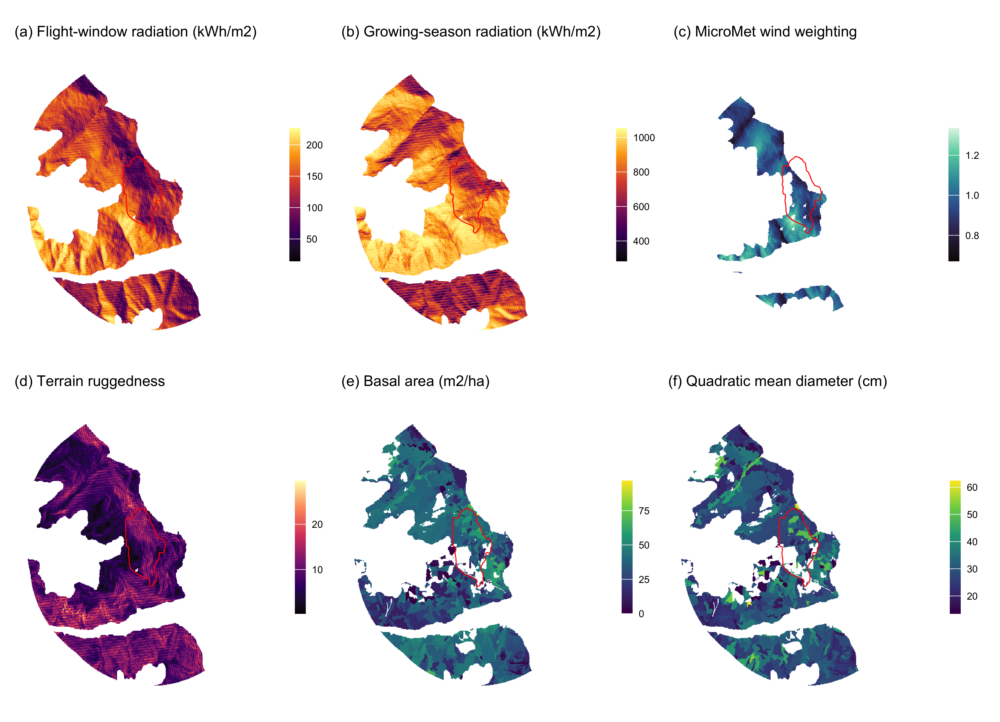

# Testing the wind disruption hypothesis for beetle refugia

*Stand density, terrain shape and flight-window wind as competing controls on mountain pine beetle attack (Dendroctonus ponderosae) in the Selkirk Mountains of British Columbia*

Generated from the rendered manuscript by `03.outputs/build-readme.py`. Do not edit this file by hand: edit `01.manuscript/beetle-topography-wind-study-short.qmd`, render, then rerun the script.

## Abstract

Refugia from mountain pine beetle (Dendroctonus ponderosae Hopkins) are hypothesised to form where stands are thin enough for wind to disrupt the pheromone plume coordinating mass attack. The hypothesis names topographic shading, low host density and few large-diameter hosts, and none has been fitted. We tested all three over 5,573 ha of the Selkirk Mountains, British Columbia, at 30 m across 914 m of relief, using Landsat at its 16-day repeat: 59 epochs across 8 outbreak years, 71,127 cell-epochs. Predictors were inventory stand structure, 29 geomorphometric surfaces, solar radiation computed separately for the flight window and the growing season, and a terrain-resolved wind field from the MicroMet model driven by hourly station data for each epoch’s own sixteen days. The wind-disruption mechanism was supported. Stand density interacted negatively with wind, -0.094 for stem density (p < 0.001) and -0.041 for standing volume (p < 0.001), and both survived a within-season spread term carrying +0.672. Host held through standing volume, +0.381, and attack peaked at 45.9 per cent at 25 to 30 cm diameter, the source-sink threshold. Topographic shading failed on its surrogate: growing-season radiation did not survive selection, and northness, which correlates -0.834 with it, is +0.382, so shaded ground carries more attack. Temporal resolution decided the outcome. With one map a year, the same wind field, covariates and threshold gave +0.031 (p = 0.036), the opposite sign. Two further specification tests showed why proxies mislead here: flight-window radiation cut the density by terrain-exposure interaction from +0.311 to +0.221 without changing its sign, and previous-year pressure left valley depth at 0.50 of its value while mid-slope position moved to 1.32. A wind test aggregated to the year answers a different question from the one the mechanism poses, and answers it wrongly.

## Results

Every figure and table below is reproduced from the current render, in the order it appears in the manuscript.

### Table 1

*Landscape attributes entered in this study, the direction expected of each, and the reasoning behind that expectation.*

| Attribute | Expected | Rationale |
| :--- | :--- | :--- |
| Stand basal area, volume, crown closure, stems | positive | Denser canopy holds the pheromone plume together; thinner stands admit wind that disperses it (Powell and Bentz 2014; Cartwright 2018; Krawchuk et al. 2020). |
| Quadratic mean diameter | positive above 25 cm | Trees under 25 cm are beetle sinks, over 25 cm are sources (Carroll and Safranyik 2004). |
| Lodgepole pine cover and basal area | positive | Attack cannot occur where the host is absent; a cell without pine is not a refugium (Cartwright 2018). |
| Flight-period direct radiation | positive | Flight is gated between 19 and 41 degrees C and peaks on bright afternoons, so sunlit slopes are reachable (McCambridge 1971; Safranyik and Carroll 2006). |
| Growing-season direct radiation | negative | Shading cools, relieving water stress and funding defence, and cool sites also push the beetle toward a two-year cycle (Krawchuk et al. 2020; Sambaraju and Goodsman 2021). |
| Terrain exposure to wind | negative | Wind disrupts the pheromone plume, so exposed ground should carry less attack (Krawchuk et al. 2020). |
| Terrain ruggedness | uncertain | The strongest terrain term in the companion study on this landscape, but fitted there against regeneration rather than attack (Murphy et al. 2026). |
| Convergence, wetness, valley depth, slope position | positive in convergent terrain | Infested groups gather in draws and gullies, and deep snow insulates overwintering brood (Safranyik and Carroll 2006). |
| Flight-period wind speed | negative | The mechanism acts during dispersal, and no study specifies the interval, so it is taken at the flight period (Jones et al. 2019; Krawchuk et al. 2020). |
| Elevation | uncertain | A composite of temperature, snowpack, season length and host distribution that this design cannot separate (Sambaraju and Goodsman 2021). |

### Figure 1

*The study area. (a) The perimeter, the 2015 Mt Midgeley burn that anchors it, and elevation. (b) Terrain ruggedness index, the strongest terrain predictor in the parent study. (c) Stand basal area from the Vegetation Resources Inventory, the density term the pheromone-disruption mechanism runs through. All panels are EPSG:3153 at 30 m; ticks are kilometres.*

### Figure 2

*The predictor surfaces, all EPSG:3153 at 30 m inside the study perimeter, with the 2015 burn outlined in red. (a) flight-window direct radiation, the thermal gate on flight; (b) growing-season direct radiation, the shading pathway; (c) the MicroMet wind weighting factor at the prevailing bearing; (d) terrain ruggedness; (e) stand basal area; (f) quadratic mean diameter, with the 25 cm source-sink threshold at the midpoint of the scale.*

### Table 2

*Moderate-to-high beetle disturbance by year inside the study perimeter.*

| Year | Cells | Moderate-to-high (%) |
| :--- | ---: | ---: |
| 2006 | 15,339 | 4.5 |
| 2007 | 15,340 | 5.6 |
| 2008 | 15,340 | 20.2 |
| 2009 | 15,340 | 11.5 |
| 2010 | 15,322 | 15.5 |
| 2011 | 15,340 | 13.3 |
| 2013 | 15,339 | 14.2 |
| 2014 | 15,340 | 15.1 |

### Table 3

*Stand structure across the study perimeter, from the Vegetation Resources Inventory.*

| Attribute | Min | Median | Mean | Max |
| :--- | ---: | ---: | ---: | ---: |
| BASAL_AREA | 2.1 | 37.1 | 35.2 | 64.3 |
| CROWN_CLOSURE | 4.0 | 48.0 | 45.3 | 60.0 |
| LIVE_STAND_VOLUME_125 | 0.9 | 292.9 | 283.4 | 620.3 |
| PINE_BA | 0.0 | 3.2 | 5.4 | 31.7 |
| PROJ_AGE_1 | 20.0 | 124.0 | 125.2 | 184.0 |
| PROJ_HEIGHT_1 | 7.7 | 29.0 | 28.1 | 41.6 |
| PinePct | 0.0 | 10.0 | 17.4 | 100.0 |
| QUAD_DIAM_125 | 13.5 | 30.3 | 30.1 | 62.3 |
| VRI_LIVE_STEMS_PER_HA | 64.0 | 686.0 | 670.0 | 1614.0 |

### Table 4

*Model comparison. Each model adds one pathway to the previous.*

| Model | Parameters | AIC | dAIC |
| :--- | ---: | ---: | ---: |
| M0 host size + shading + landform | 15 | 49,547 | 2,307 |
| M1 + stand density | 18 | 49,049 | 1,809 |
| M2 + terrain and flight radiation | 25 | 48,305 | 1,065 |
| M3 + interactions | 30 | 47,240 | 0 |

### Table 5

*Full model, continuous terms. Coefficients are per standard deviation on a class-balanced sample, so the intercept is not landscape prevalence. The geomorphon landform classes are also in this model and are not reported here.*

|  | Term | Beta | SE | z | p |
| :--- | :--- | ---: | ---: | ---: | ---: |
| solar_flight_direct | solar_flight_direct | +0.487 | 0.028 | 17.21 | < 0.001 |
| PINE_BA | PINE_BA | +0.459 | 0.014 | 32.40 | < 0.001 |
| QUAD_DIAM_125 | QUAD_DIAM_125 | -0.422 | 0.023 | -18.35 | < 0.001 |
| northness | northness | +0.382 | 0.016 | 23.19 | < 0.001 |
| LIVE_STAND_VOLUME_125 | LIVE_STAND_VOLUME_125 | +0.381 | 0.024 | 15.61 | < 0.001 |
| wind_effect | wind_effect | +0.358 | 0.029 | 12.37 | < 0.001 |
| elevation | elevation | +0.329 | 0.018 | 18.20 | < 0.001 |
| VRI_LIVE_STEMS_PER_HA:wind_effect | VRI_LIVE_STEMS_PER_HA:wind_effect | +0.221 | 0.021 | 10.63 | < 0.001 |
| PROJ_AGE_1 | PROJ_AGE_1 | +0.218 | 0.018 | 11.89 | < 0.001 |
| jul | jul | +0.215 | 0.012 | 17.84 | < 0.001 |
| valley_depth | valley_depth | -0.193 | 0.022 | -8.70 | < 0.001 |
| CROWN_CLOSURE | CROWN_CLOSURE | -0.183 | 0.020 | -9.02 | < 0.001 |
| VRI_LIVE_STEMS_PER_HA:solar_flight_direct | VRI_LIVE_STEMS_PER_HA:solar_flight_direct | -0.144 | 0.017 | -8.58 | < 0.001 |
| jun | jun | +0.107 | 0.012 | 8.66 | < 0.001 |
| VRI_LIVE_STEMS_PER_HA | VRI_LIVE_STEMS_PER_HA | -0.099 | 0.018 | -5.36 | < 0.001 |
| twi | twi | +0.073 | 0.019 | 3.74 | < 0.001 |
| midslope_position | midslope_position | +0.063 | 0.013 | 4.69 | < 0.001 |
| vrm | vrm | -0.043 | 0.019 | -2.21 | 0.027 |
| tpi | tpi | +0.040 | 0.023 | 1.77 | 0.076 |
| curv_prof | curv_prof | -0.038 | 0.012 | -3.04 | 0.002 |
| tri | tri | -0.036 | 0.023 | -1.54 | 0.124 |
| convergence | convergence | -0.029 | 0.014 | -2.07 | 0.038 |
| VRI_LIVE_STEMS_PER_HA:jun | VRI_LIVE_STEMS_PER_HA:jun | -0.001 | 0.013 | -0.12 | 0.905 |

### Figure 3

*The refugia mechanism as fitted. (a) Predicted probability of moderate-to-high disturbance against terrain-resolved epoch wind, at the 10th and 90th percentiles of stem density, all other terms held at their means; the lines cross, so wind raises attack in thin stands and lowers it in dense ones, which is the interaction. (b) The same for standing volume. (c) Coefficients of the 16-day model, with and without the within-season spread term. (d) Epoch prevalence against epoch mean wind, one point per epoch.*

### Table 6

*The wind terms under two specifications, both with previous-year pressure in the model. M4 carries station wind, which is flat within a year and identified only across years. M5 carries the terrain-resolved MicroMet field, which varies within the year and is identified in space.*

| Model | Term | Beta | z | p |
| :--- | :--- | :--- | ---: | ---: |
| M4 station wind | jun | -0.002 | -0.09 | 0.926 |
| M4 station wind | VRI_LIVE_STEMS_PER_HA:jun | +0.020 | 1.16 | 0.247 |
| M5 terrain-resolved wind | mm_flight_mean | +0.467 | 28.44 | < 0.001 |
| M5 terrain-resolved wind | VRI_LIVE_STEMS_PER_HA:mm_flight_mean | +0.031 | 2.09 | 0.036 |

### Table 7

*Moderate-to-high beetle disturbance by quadratic mean diameter class, on the balanced sample. The 25 cm boundary is the source-sink threshold of the species’ bionomics.*

| QMD class (cm) | Cells | Attacked (%) |
| :--- | ---: | ---: |
| <15 | 736 | 31.5 |
| 15-20 | 2,371 | 23.8 |
| 20-25 | 7,058 | 36.3 |
| 25-30 | 14,634 | 45.9 |
| 30-40 | 18,902 | 24.5 |
| >40 | 3,627 | 17.0 |
